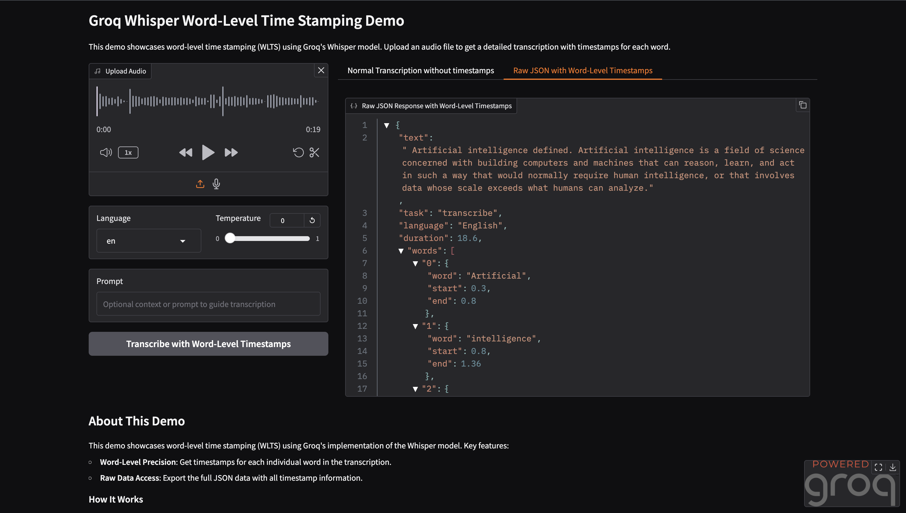

# Groq Whisper WLTS Demo

A Gradio-based demo showcasing Word-Level Time Stamping (WLTS) using Groq's implementation of the Whisper model.

## Features

- Upload audio files and get precise word-level timestamps
- Support for multiple languages
- Adjustable transcription parameters
- Export raw JSON with detailed timing information



## Installation

1. Clone this repository:
   ```bash
   git clone https://github.com/kiruthika0111/groq-whisper-wlts-demo.git
   cd groq-whisper-wlts-demo
   ```

2. Install dependencies:
   ```bash
   pip install -r requirements.txt
   ```

3. Set your Groq API key in .env:
   ```bash
   GROQ_API_KEY='your_api_key_here'
   ```

## Usage

Run the demo:
```bash
python app.py
```

The Gradio interface will launch and be accessible at http://localhost:7860 by default.

## How It Works

The demo leverages Groq's Whisper API to provide word-level time stamps for audio transcription:

1. When a user uploads an audio file, it's sent to the Groq API with the `timestamp_granularities=["word"]` parameter
2. The API returns a detailed JSON response with timing information for each word
3. The demo processes this data to create:
   - A clean transcript
   - Access to the raw JSON data

## Business Applications

Word-level time stamping unlocks numerous business applications:

- **Media Production**: Create precisely timed subtitles and closed captions
- **Accessibility**: Develop tools for hearing-impaired users with word highlighting
- **Education**: Build language learning applications with word-by-word pronunciation
- **Search & Analytics**: Enable searching within audio content with precise timestamps
- **Meeting Intelligence**: Track speaker contributions and create interactive transcripts

## Requirements

- Python 3.8+
- Groq API key
- Dependencies listed in requirements.txt:
  - gradio
  - groq
  - numpy
  - pydub

## License

MIT

## Acknowledgments

This project was created for the Groq WLTS Challenge. Thanks to Groq for providing access to their API and Whisper implementation.